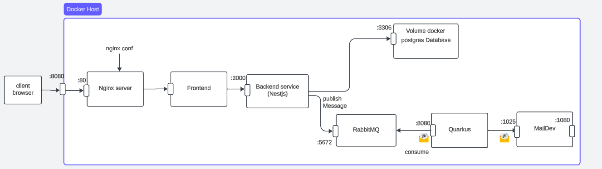

# 🏗️ Architecture Logicielle – Application de Gestion d’Associations Étudiantes

**Réalisé par :**  
👨‍💻 BERTHE Moussa  

---

## 🎯 Objectif du Projet

Développer une application complète de **gestion d’associations étudiantes**, d’abord en architecture **monolithique**, puis en **microservices distribués** pour améliorer la scalabilité, la résilience et la maintenabilité.

---

## 🧩 Schéma Global de l’Architecture

L’architecture distribuée comprend plusieurs composants principaux, chacun déployé dans un **conteneur Docker**.



### Composants :

- **Frontend (Angular 16)** : Interface utilisateur, communication avec le backend via HTTP.
- **Backend (NestJS)** : Logique métier, gestion de la base de données, publication de messages RabbitMQ.
- **Nginx** : Sert le frontend statique et fait office de reverse proxy vers le backend.
- **RabbitMQ** : Système de messagerie pour la communication asynchrone entre services.
- **Quarkus** : Service consommateur de messages RabbitMQ, envoie des mails via MailDev.
- **MailDev** : Serveur mail SMTP et interface web pour consulter les e-mails générés.
- **PostgreSQL** : Base de données relationnelle persistante.
- **Prometheus & cAdvisor** : Supervision et monitoring des conteneurs Docker et performances de l’application.

---

## ⚙️ Communication entre Services

| Service        | Port  | Description |
|----------------|-------|-------------|
| Frontend → Backend | 3000 | Requêtes API |
| Backend → RabbitMQ | 5672 | Publication de messages |
| Quarkus → MailDev (SMTP) | 1025 | Envoi des e-mails |
| MailDev (UI) | 1080 | Consultation des mails |
| Nginx | 81 | Reverse proxy et accès web |
| Prometheus | 9090 | Monitoring des métriques |
| cAdvisor | 8080 | Collecte des métriques conteneurs |

---

## 🧱 Architecture Alternative

Une alternative possible est une **architecture monolithique**, regroupant tous les composants dans une seule application.  
Cette approche est plus simple à déployer mais moins évolutive et résiliente que l’architecture distribuée actuelle.

---

## 🧠 Rôle des Composants

| Composant | Rôle |
|------------|------|
| **Frontend (Angular)** | Interface utilisateur, envoi de requêtes au backend |
| **Nginx** | Sert le frontend et redirige les requêtes vers le backend |
| **Backend (NestJS)** | Logique métier, accès base de données, publication RabbitMQ |
| **Quarkus** | Consommation de messages RabbitMQ, envoi de mails |
| **RabbitMQ** | Gestion des échanges de messages entre services |
| **MailDev** | Réception et affichage des mails envoyés |
| **PostgreSQL** | Stockage des données persistantes |
| **Prometheus** | Collecte des métriques de performance |
| **cAdvisor** | Exposition des métriques conteneurs à Prometheus |

---

## ⚖️ Choix d’Architecture

| Architecture | Avantages | Inconvénients |
|---------------|-------------|----------------|
| **Monolithique** | Simple à déployer, facile à maintenir pour petites applis | Peu scalable, difficile à faire évoluer |
| **Microservices** | Scalable, résilient, modulaire | Plus complexe à configurer et à superviser |

---

## 🧩 Liste des Services Implémentés

### Frontend
- Angular 16  
- Communication avec le backend via le port 3000  

### Backend
- NestJS  
- TypeORM + PostgreSQL  
- Publication des messages vers RabbitMQ  

### Quarkus
- Consommation RabbitMQ  
- Envoi des mails via MailDev  

### Nginx
- Reverse proxy et serveur statique  

### RabbitMQ
- Message broker (port 5672)

### MailDev
- SMTP (1025) & interface web (1080)

### Prometheus & cAdvisor
- Monitoring des conteneurs et performances  

---

## ⚙️ Configuration de l’Application

### Variables d’environnement (.env)
- **Base de données :**
  - `POSTGRES_USER`
  - `POSTGRES_PASSWORD`
  - `POSTGRES_DB`
  - `POSTGRES_PORT`
  - `POSTGRES_HOST`

- **RabbitMQ :**
  - `RABBITMQ_URL`
  - `RABBITMQ_DEFAULT_USER`
  - `RABBITMQ_DEFAULT_PASS`

### Fichiers de configuration
- `nginx.conf` → configuration du proxy et du routage
- `prometheus.yml` → configuration du monitoring
- `application.properties` → configuration du service Quarkus

---

## 🚀 Commandes d’Exécution

| Service | Commande |
|----------|-----------|
| Backend | `npm run start:dev` |
| Frontend | `ng serve --open` |
| Nginx | `nginx -g 'daemon off;'` |
| Prometheus | `--config.file=/etc/prometheus/prometheus.yml` |
| Docker Compose | `docker compose up` |

---

## 🔗 Dépendances entre Services

- **Frontend → Backend**
- **Backend → PostgreSQL & RabbitMQ**
- **Nginx → Frontend & Backend**
- **Quarkus → RabbitMQ**
- **MailDev → Quarkus**
- **Prometheus → Backend & cAdvisor**

---

## 🧰 Déploiement & Utilisation

1. Cloner le dépôt :
   ```bash
   git clone https://github.com/bertheMoussa/Projet_Architecture_Logicielle.git
   cd Projet_Architecture_Logicielle
2. Lancer docker sur votre machine de préférence docker-desktop
3. Lancer la commande **docker compose up** pour lancer tous les containers
4. Ouvrir la page web de maildev à l’adresse localhost:1080 pour voir les emails d'ajout d'un utilisateur à un association
5. Aller sur l’url localhost:81
6. Cliquer sur le bouton frontend page pour avoir accès la page d’accueil du front-end
7. Sur la barre de navigation cliquer sur l’item utilisateurs pour creer un/plusieurs utilisateurs.
8. Créer une association avec certains utilisateurs en mettant leurs ID dans le champ MembersId
9. On aura un email sur le serveur mail au localhost:1080 notifiant l'utilisateur de son ajout à l'association

## 🎬 Démonstration du projet

Voici une courte vidéo de démonstration de l’application :

[▶️ Voir la vidéo de démonstration sur Google Drive](https://drive.google.com/file/d/1jBCBe_yVRmk-dUtLY7Jv16tT0pjNUowQ/view?usp=sharing)